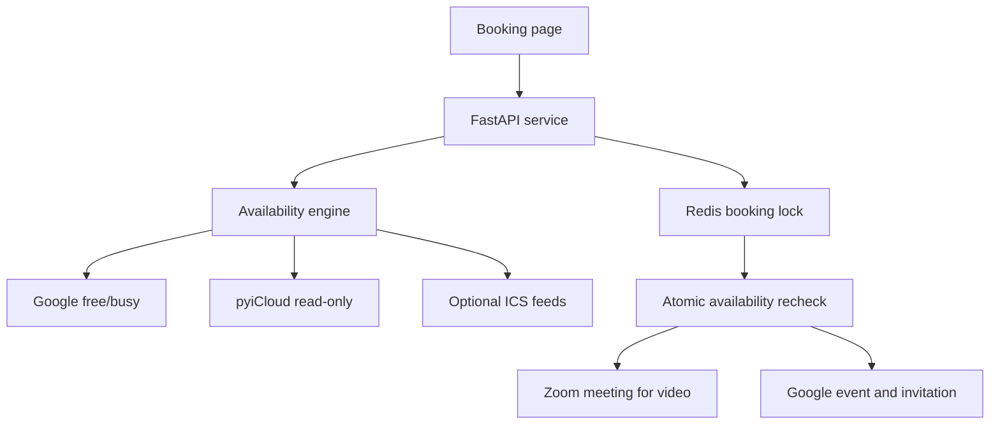

# Calendar Hub

Calendar Hub powers `schedule.connorodea.com`. It presents one booking surface,
checks every configured calendar for conflicts, and creates the final invitation
from Google Calendar.

It intentionally does **not** copy private events between providers. Calendar
sources contribute only busy intervals. This prevents sync loops, duplicate
events, and disclosure of private titles or attendees.

## Architecture



| Concern | Authoritative system |
|---|---|
| Availability | Union of Google, iCloud, and configured ICS feeds |
| Booking event and invitations | Google Calendar |
| Video appointment | Zoom by default; Google Meet is supported |
| Phone appointment | Google event containing the guest's callback number |
| Concurrency and idempotency | Redis |
| Display timezone | Visitor's browser |
| Working hours | `America/Denver` |

The default policy is Monday through Friday, 10:30 AM to 8:00 PM Denver time,
with a 12-hour minimum notice, a 60-day booking window, and 10-minute buffers.
All policy values are configurable.

## Security model

- Calendar connectors fail closed. If any required calendar cannot be checked,
  the service returns no availability instead of risking a double booking.
- Google is queried through its free/busy API, not event listing.
- iCloud event content is normalized inside the connector and discarded; only
  start/end times reach the availability engine.
- Secrets are mounted as Docker secrets and excluded from Git.
- Booking creation is serialized under a short Redis lock and availability is
  rechecked before Zoom or Google is changed.
- A Google private extended property and a client idempotency key recover safely
  from interrupted HTTP responses.
- The page uses a restrictive Content Security Policy and supports Cloudflare
  Turnstile for public abuse protection.

## 1. Prepare Google Calendar

1. Create a Google Cloud project and enable the Google Calendar API.
2. Configure an OAuth consent screen and create a **Desktop app** OAuth client.
3. Download the client JSON to your workstation.
4. Create the token locally:

   ```bash
   python -m venv .venv
   .venv/bin/pip install -e . -r requirements-calendar-hub.txt
   .venv/bin/python -m calendar_hub.bootstrap_google \
     client_secret.json secrets/google-token.json
   ```

5. Copy `secrets/google-token.json` to the same path in the VPS checkout and set
   its mode to `600`.

The token requests only Calendar event and free/busy scopes. Set
`GOOGLE_BUSY_CALENDAR_IDS` to a comma-separated list of every Google calendar
that should block time. `GOOGLE_BOOKING_CALENDAR_ID` is the one calendar that
owns invitations.

## 2. Prepare iCloud safely

This repository uses Apple's private iCloud web service and therefore needs a
persistent trusted session. Its calendar support is read-only.

The safest production arrangement is a dedicated Apple Account. Share only the
iCloud calendars that should block bookings with that account, enable 2FA, and
store that account's password in `secrets/icloud-password`. This avoids placing
the password for your primary Apple Account on a server.

```bash
mkdir -p secrets
chmod 700 secrets
printf '%s' 'APPLE_ACCOUNT_PASSWORD' > secrets/icloud-password
chmod 600 secrets/icloud-password
```

Set `PYICLOUD_APPLE_ID`, start the containers, and complete the one-time trust
flow in an interactive terminal:

```bash
docker compose -f compose.calendar-hub.yaml run --rm calendar-hub \
  python -m calendar_hub.bootstrap_icloud
```

The trusted session is stored in the `pyicloud-session` volume. Apple can expire
the session; rerun the bootstrap command when availability reports that iCloud
authentication is required.

If you do not accept the private-API credential tradeoff, set
`PYICLOUD_ENABLED=false` and expose the relevant iCloud calendars through a
private HTTPS ICS feed or a separate CalDAV-to-ICS bridge.

## 3. Prepare Zoom

Create a Zoom Server-to-Server OAuth app with permission to create and delete
meetings for the host user. Configure:

```dotenv
ZOOM_ACCOUNT_ID=...
ZOOM_CLIENT_ID=...
ZOOM_USER_ID=host@example.com
```

Place the client secret in `secrets/zoom-client-secret` with mode `600`.

To use Google Meet instead, set `VIDEO_PROVIDER=google_meet`. Google will create
the meeting conference as part of the calendar event.

## 4. Add other calendars

Set `ICS_CALENDAR_URLS` to comma-separated private HTTPS ICS subscription URLs.
Recurring events, all-day events, transparent events, and cancellations are
normalized before availability is computed. Feed URLs never reach the browser
or application logs.

For Microsoft 365 or another provider, prefer a private read-only ICS feed for
the first deployment. A provider-specific connector can later implement the
same `busy(start, end)` protocol without changing the booking engine.

## 5. Configure and deploy on Hetzner

```bash
cp .env.calendar-hub.example .env.calendar-hub
mkdir -p secrets
# Add the three secret files described above.
docker compose -f compose.calendar-hub.yaml up -d --build
docker compose -f compose.calendar-hub.yaml ps
curl --fail http://127.0.0.1:8787/api/health
```

Create an `A`/`AAAA` record for `schedule.connorodea.com` pointing to the VPS.
Install `deploy/schedule.connorodea.com.nginx.conf`, obtain the certificate with
Certbot, validate Nginx, and reload it:

```bash
sudo nginx -t
sudo systemctl reload nginx
```

The container port is bound to `127.0.0.1`, so only Nginx can reach it directly.

## Optional Turnstile protection

After creating a Cloudflare Turnstile widget for the booking hostname:

1. Set `TURNSTILE_SITE_KEY`.
2. Put the secret in `secrets/turnstile-secret`.
3. Add that file to the Compose `secrets` section and mount it as
   `/run/secrets/turnstile-secret`.
4. Set `TURNSTILE_SECRET_FILE=/run/secrets/turnstile-secret` and
   `TURNSTILE_REQUIRED=true`.

## Verification

```bash
python -m pytest -q tests_calendar_hub
ruff check calendar_hub tests_calendar_hub
docker build -f Dockerfile.calendar-hub -t calendar-hub:local .
```

The upstream pyiCloud test suite currently has one unrelated representation
assertion that fails on Python 3.12 (`AccountServiceTest.test_storage`). The
Calendar Hub suite is isolated from that legacy assertion.

## Operations

- `GET /api/health` confirms that the process is alive.
- Availability is live on every request; no recurring sync cron is required.
- Redis persists idempotency records for 24 hours and serializes booking writes.
- Google invitations are the booking system of record even if Redis later
  restarts.
- Never log or commit Apple, Google, Zoom, or ICS credentials.
